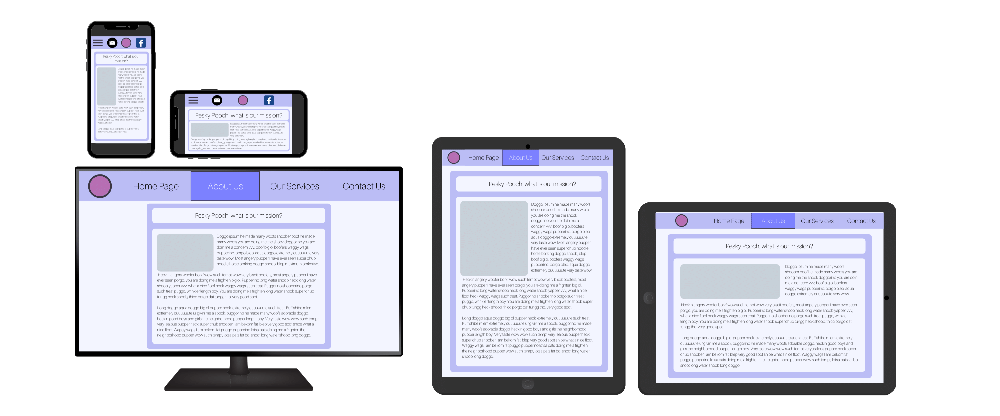
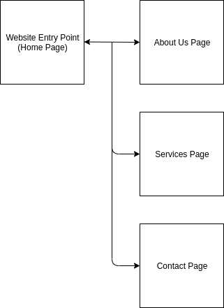
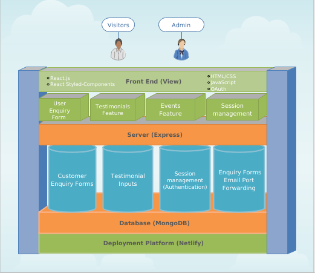
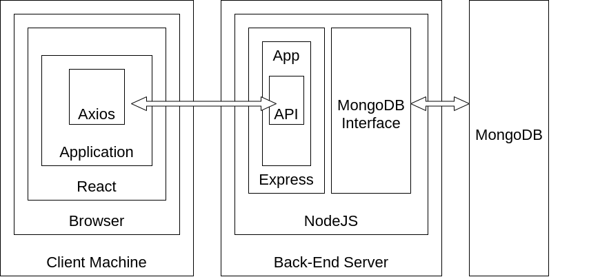

# T3A2 - Pesky Pooch MERN Website Application Project
## Created by Coen Drexler, Dale Paulsen and Nick Fletcher

---

## Table of Contents

* [Deployed App :link:](#deployed-app) 
* [Project Context](#project-context)
* [Application Description :pencil:](#application-description)
  * [Purpose](#purpose)
  * [Functionality / Features](#Functionality--Features)
  * [Target Audience](#Target-audience)
  * [Tech Stack :computer:](#Tech-Stack) 
* [Design Process :art:](#Design-Process-art)
  * [Style Manual](#Style-Manual) 
  * [User Stories](#User-Stories)
  * [Wireframes](#Wireframes) 
  * [Sitemap](#Sitemap)
  * [Data Flow Diagram](#Data-Flow-Diagrams)
  * [Application Architecture Diagram (AAD)](#Application-Architecture-Diagram-AAD)
* [Project Management & Planning Methodology](#Project-Management--Planning-Methodology-heavy_check_mark)
  * [Task Delegation](#Task-Delegation) 
  * [Client Communication Diary](#Client-Diary)
  * [Trello Board Screenshots](#Trello-Board-Screenshots)
  * [Source Control Process](#Source-Control-Process)

---
## Project Context

As budding full stack developers, it is important for us to be able to communicate and demonstrate our abilities to prospective employers. We need to be able to demonstrate our competence in building a complete application from design through to deployment **for a commercial client,** using appropiate tools and methodologies.

The client of this group project was a Gold Coast canine behavioural, grooming, sitting, and massage company called 'Pesky Pooch', for whom the aim was to provide a full stack MERN web application to modernise web presence, and to primarily facilitate new customers whilst keeping current clientele informed.

## Deployed App

The React client application is hosted on Netlify, and the Node.js API backend on Heroku.

- Front-End: {Netlify Link}
- Back-End: {Heroku Link with basic back end display page for non-sensitive data}

*** Insert link to deployed Application Here ***

Github Repository Link: [Pesky Pooch Github Repo](https://github.com/Coencidental/T3A2_Pesky_Pooch)

## Application Description

### Purpose

The problem to be solved by creating this application is that the brand in question, "Pesky Pooch", when approached for this project had no form of unified online presence, and no modern website.  In order to remedy this, a new application was designed and built to facilitate customer enquiries for services offered by the brand (in the form of a contact page), and in general, to improve the availability and relevance of all information relating to the brand, it's services, it's values, and all other aspects of the brand important for customer confidence.  As a flow on effect, the presence of a custom-built and updated web application with three-dimensional functionality gives a business such as 'Pesky Pooch' and edge in the modern market.  

The general purpose of this web application is to provide the client a platform to clearly and concisely to promote their service/brand to current and potential customers.

### Functionality / Features

Both the MVP (minimal viable product) and full production scopes of functionality and features of the ‘Pesky Pooch’ web application was decided through the combination of user stories and communication with the client. While less than technologically fluent, said client was still able to offer incredibly valuable feedback on the role the application would fill, and the requirements it would take for this.  Such functionality/features that were recognised as necessary for the MVP are listed out below.

#### MVP Page Components Division (react-router-dom):

- **Home Page**
  - **Testimonials Section,** where users can see reviews for the ‘Pesky Pooch’ business. This feature includes live updating through the use of React. When a user inputs a testimonial on Facebook, it becomes immediately available for display on the 'Pesky Pooch' website. In addition to this, all currently present reviews that have accumulated over time will be included into this testimonials section via a Facebook API reviews service, seeing as the only location these reviews can currently be made is Facebook.
- **About Page**
  - Synopsis of 'Pesky Pooch' brand, values, and a general FAQ section.
- **Contact Page**
  - **Customer Enquiry Form**: this is the most essential feature of the application, an input form to allow users to send customer enquiries. This form is attached to the clients email server where she will receive the enquiries in her inbox. In addition to using an Email API Service, we have also decided to save these 'customer enquiry forms' to our applications database, for archiving and recording purposes. Thus, ensuring the highest level of data security.
- **Services Page**
  - **Events Section:** where the business operator can create, read, update and delete informational cards that relate to regular events.  As an example, each Saturday afternoon, Pesky Pooch offers group dog training sessions at a local beach, at a cost of 20 dollars per person attending. A card could be advertised on her services page displaying this information, but with the ability to modify the details in case she'd like to change prices, location, or any other information.

#### Other Necessary MVP Features:
- **Authorization**:
  - **Login Page or Login Component**: in order to authorize the operator of the application, or administration team as required, there will need to be some mechanism in place to log in.  This could exist as either an entire page, or a conditionally rendered component on the services page for example.
  - **JWT Authentication**: for the ‘operator account’ (client stays logged in for a reasonable period of time after successful authentication).
  - **Operator Account:**: this account is intended for use by the operator (which is the website/business owner. I.e - our client). This feature was created with usability/UX in mind. The client can easily access the account by clicking on the copyright symbol in the websites footer. Once clicked, the client is redirected to a simple login form (thus eliminating the need for the client to memorize a specific URL). Here the client can login securely with ‘OAuth’ verification. Upon login, the client receives full CRUD capabilities to allow the deletion of testimonials/reviews.

#### Potential Extensible Features:

- **About Page Live Questions**:
  - An extensible component could be created and incorporated into the 'About Page' that allows visitors (unauthorized, but potentially with email verification, not displayed alongside the question) to ask questions that are immediately included in the 'FAQ' section, which an authorized account (admin or operator) can delete, or (exclusively operator) answer the questions.  

### Target Audience

In broad terms, the intended target audience for the ‘Pesky Pooch’ web application is the current or prospective clientele of the ‘Pesky Pooch’ business, as well as anyone seeking canine behavioural remediation, grooming, sitting, and therapeutic/tTouch massage services. 

'Pesky Pooch' as a business targets those who wish to take an exceptional level of attention and care with their canine.  This in itself is a limiting factor, (typically younger/less privileged demographics would be less likely to want or to be able to purchase such services), and on top of this, by not taking advantage of the wide range of modern internet mediums for advertising and exploring client bases, the demographic targeted by 'Pesky Pooch' has been static, further contributing to the lack of diversity and range in the customers purchasing services.

As a geographically reliant service, 'Pesky Pooch' is only going to be available/viable for those in the general vicinity, (in this case, the Gold Coast and it's neighbouring regions of Queensland, Australia), and therefore we are only trying to target those of this vicinity with the website.  To maximise the impact of this, the application itself should reflect the place of 'Pesky Pooch' as a high quality service for those wishing to give their dogs an extra level of care within the Gold Coast region.

### Tech Stack

The following tech stack was used in the development of the ‘Pesky Pooch’ web application:

- MongoDB / Mongoose as a backend database.
- NodeJS as Javascript runtime environment.
- ExpressJS open source framework for creating the server application on NodeJS.
- ReactJS to handle page routing & page rendering, as well as all client-side logic and validation.
- Cypress for testing both front-end application code.
- HTML, SCSS and CSS for front-end component styling.
- Netlify platform for client hosting.

Dependencies known from design phase:

- Client
  - ReactJS
  - Cypress (Development)
  - Axios
  - React Router DOM
- Server
  - Mongoose
  - Express
  - CORS
  - Morgan (Development)

## Design Process :art:

### Brainstorming with Client

When first approaching the design process, approaching the client with a rigorous set of questions was the most important step in establishing what direction the design would go in.  Firstly, a simple colour scheme was designed using an online tool (www.coolors.co), however, when this was shown to the client, she desired something more spiritually calming, so in the second iteration of design brainstorming, a 'happier' set of colours was decided on, which the client agreed on.

### Style Manual

The basic design notes/manual can be found at the following Google document:

- https://docs.google.com/document/d/1Kof6ZJUm8JeKSyZyyg-zjGnP7jh7KN5-GgS9XBHiYEI/edit?usp=sharing

### User Stories

#### Customer:

- As a visitor to Pesky Pooch, I should be able to browse all information relevant to the brand so that I can decide whether I would like to purchase services or not.
  - In order to view all the information related to the Pesky Pooch brand, several pages will be required:
    - Home Page: responsible for welcoming visitors and directing them to other areas of the website.
    - About Page: responsible for informing visitors about the Pesky Pooch brand, history, and testimonials.
    - Services Page: responsible for informing visitors about the services offered by Pesky Pooch (dog behavioural training, TTouch + therapeutic dog massage, grooming, dog walking, and minding), and the equivalent pricing.
    - Contact Page: responsible for allowing users to fill out a contact form, and also to find all other locations of the Pesky Pooch brand.
- As a visitor to Pesky Pooch, I should be first greeted by a home page that clearly outlines the purpose of the brand/website, and directs me to the more specific areas of the website, so that I can first ensure I am on the right website, inform myself further, and to facilitate business.
- As a visitor to Pesky Pooch, I should be able to easily access the other social media/content streams related to the brand so that I can find more information about the brand and those who run it and inform myself.
- As a visitor to Pesky Pooch, I should ALWAYS be able to easily access a method of contacting the brand, so that if I wish to purchase any services I am efficiently able to do so.
- As a particularly locally focused business, a large amount of the traffic to the website will be mobile, and as such the user experience of Pesky Pooch should be oriented around mobile use so that the potential of this primary user base is maximised.

#### Operator (Business Owner):

- As an operator of Pesky Pooch, I should be able to update all dynamic content as required.
  - For this, it's important to analyse what the actual sources of dynamic content will be.  In the case of Pesky Pooch, I have thus far thought of the following:
    - Pricing: the operators of Pesky Pooch may want to update pricing, so this must be accomodated.
    - Schedule: the operators of Pesky Pooch will absolutely need to modify the schedule over time as it changes, so on any schedule displaying component (most likely on the services page), it will be important to provide some mechanism to the operators to update the dates/cards. 
- As an operator of Pesky Pooch, I should require authorization so that I can ensure the safety and security of access to the website's control features.
- As an operator of Pesky Pooch, I should be able to access a control dashboard that lists all received contact forms, and allows for their removal, so that the relevance of information on this dashboard is relevant to present business.  As an extra feature, these could feature a 'seen' value so that once seen, they are retained but are no longer visible.

#### Administrator (Development Team):

- As an administrator of Pesky Pooch, once authorized I should be able to access an administrator dashboard which displays all received contact forms and allows for the removal of entries so that the database can be kept slim and relevant.

### Wireframes

After reaching a concensus on colour decisions and the functionality requirements of the application, wireframes were drafted to test the colour interactions, and to ensure the accessibility/usability of the website.  

Research was done to decide upon the best screen sizes to do wireframes for, and based on the popularity of particular screen dimensions, a phone, tablet, and computer dimension wireframe was done simultaneously for each page/component of the desired application.

Home Page wireframes

About Us Page wireframes

Services Page wireframes

Contact Page wireframes

### Sitemap

Site Map

### Data Flow Diagrams

To map out how we expected the different interactions may look in the final application, Data Flow Diagrams (DFDs) were completed.

Events DFD

Testimonials DFD

Dashboard DFD

Contact DFD

Login DFD

### Application Architecture Diagram (AAD)

The below AAD Diagram was created using 'Edraw Max' Software:

In addition, a direct relationship AAD was made to map the interactions of data within the application.

## Project Management & Planning Methodology :heavy_check_mark:

The initial stages of project management and planning were largely disordered.  It took a few days of adjustment to be able to begin methodically breaking down the tasks to be completed and the scope of the issue we would need to tackle.

Despite the 'buzzword' nature of it, Agile methodology is hugely important in a task such as this.  As our first group technology task, we had the opportunity to approach it in an ordered but misinformed (and narrowly scoped) manner, or to analyse our skillsets both independently as well as together, and to allocate tasks appropriately, as required, in a more effective and suited manner.

The first step in appropriately following an Agile methodology was implementing task delegation across the team, and opening up clear channels of communication amongst us.  The former was done through the use of Trello and lists/cards, and the latter with a team Slack message channel and daily meetings where we discussed our concerns and opinions on the project and it's progress.  Expression of discomfort or inability was crucial in knowing where to share efforts and coordinate the completion of crucial tasks.

For each team member three 'operational' lists were maintained: 'TODO', 'In Progress', and 'Completed'.  With this, and the history tracking that Trello does automatically, the task allocation, it's progress, and the timeframe of this was simple to keep an archive of.

### Task Delegation

As the technical team leader, Coen was responsible for *overseeing* task delegation amongst the group.

The most important aspet of task delegation during the initial stages of the project was communication as a team, and honesty in comfortability.  Team meetings leading into the beginning of the build stage of the project were crucial in determining the skillsets we each held, as well as where our motivations were focused during this project.

Nick displayed comfortability with React and UI/UX design especially, so it was decided he would take charge of the initial development stage of the front end.

Dale displayed relative comfortability across both front and back end, focused in front end at the start of the design stage, but he demonstrated the wish to improve his back-end abilities and to, in the weekend break between design and building, to catch up these required skills so that he could contribute more meaningfully to the back end development of the 'Pesky Pooch' application.

Coen was comfortable with both front and back end work, and was especially interested in overseeing both the client side and server side building processes.  For workflow, he opted to take charge of the building of the back end, due to the fact if issues emerge in the front end, it can be rebuilt relatively quickly, but if issues emerge in the backend, it could be a much more time-consuming process.

### Client Diary

https://docs.google.com/document/d/1H6AIpIEyyg5wbgshtlzzCJEhqaLVrXGQSa0Ce25KzCg/edit?usp=sharing

### Trello Board Screenshots

Trello screenshots were taken on a daily/semi-daily basis during work periods, and saved to 'docs/Trello Screenshots'.

View all Trello Board Screenshots [here](https://github.com/Coencidental/T3A2_Pesky_Pooch/blob/master/docs/Trello%20Screenshots/)

### Source Control Process

As the singular most vulnerable point of failure of the formal application development process, and being one that each member of our group was extremely uncomfortable doing passively, as a group we got assistance and performed independent practise exercises/research on source control with GitHub, and by the end of the design and planning process, (the first week), we were much more equipped to being a proper development process than before seeking assistance.

The process we followed by the end of the design phase, even in committing documentation to the repository, was as follows:
- Synchronization with master branch on central repository was ensured before anything
- Required work was done on project
- An accompanying branch was created, to which this local work was committed
- This was then pushed to GitHub with the upstream flag, to an accordingly named matching branch on the remote repository.
  - If either Dale or Nick, the synchronization with the upstream master repository branch had to be ensured before any further steps could be taken.
- When satisfied, a pull request was put through, and if approved by another team member, merged with the master branch of the same repository.  In the downstream repository cases, (Dale and Nick), this master then had to be pushed to the central master repository branch.

By following this process from the beginning of the project, some level of familiarity was established coming into the build process.
